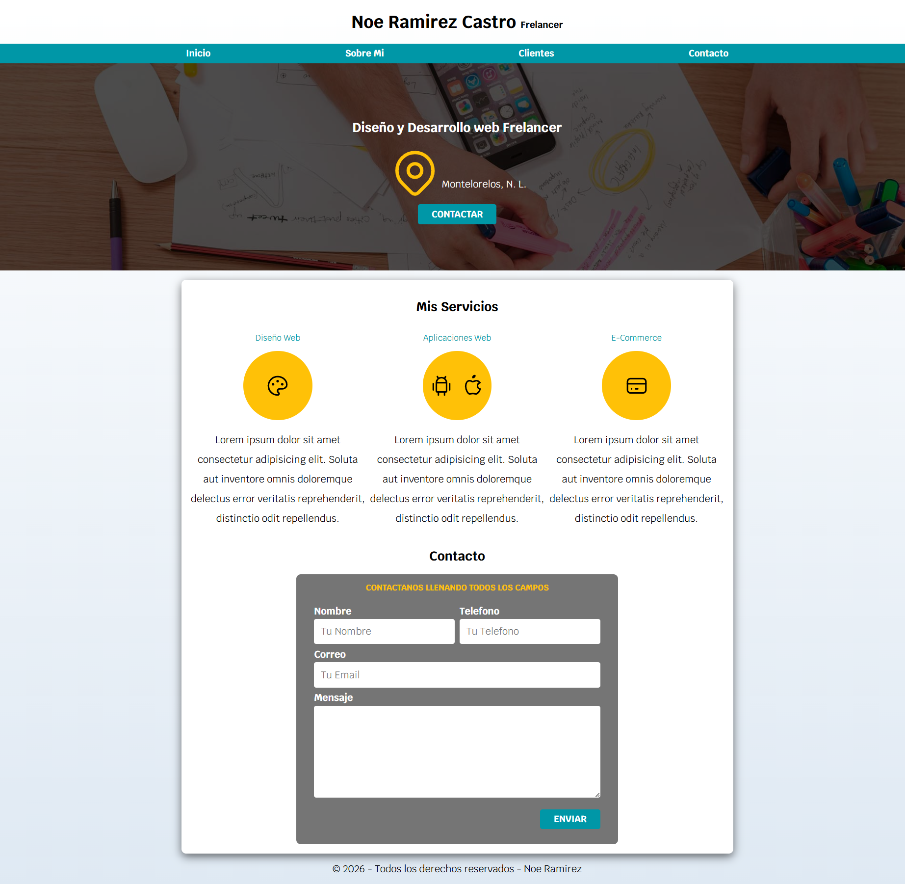

# 🌐 Sitio Freelancer — Noe Ramirez Castro

Portafolio web personal de servicios freelancer: diseño web, aplicaciones web y e-commerce. Desarrollado con HTML5 y CSS3 puro, con diseño responsivo y enfoque en rendimiento.

🔗 **[Ver Demo en vivo](https://noahxd-dev.github.io/Sitio-FreeLancer/)**

---

## 🛠️ Tecnologías

- **normalize.css** v8.0.1 — Reset de estilos entre navegadores
- **Google Fonts** — Fuente Krub (400 y 700)
- **SVG Icons** — Íconos de Tabler Icons

---

## 📸 Demo

> Visita el sitio en vivo aquí 👉 [noahxd-dev.github.io/Sitio-FreeLancer](https://noahxd-dev.github.io/Sitio-FreeLancer/)

---

## 📸 Vista previa

---

> © 2025 Noe Ramirez — Todos los derechos reservados.
